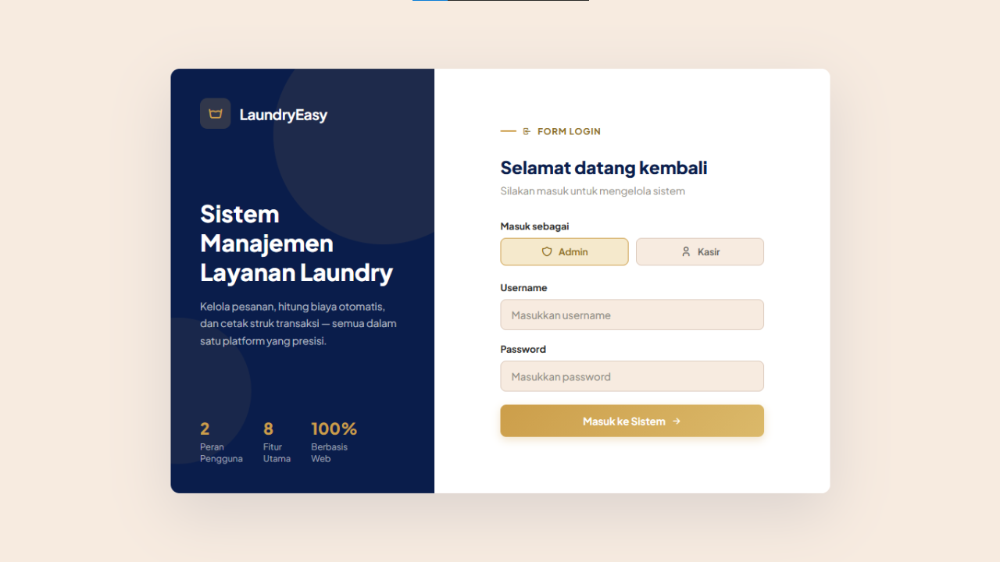
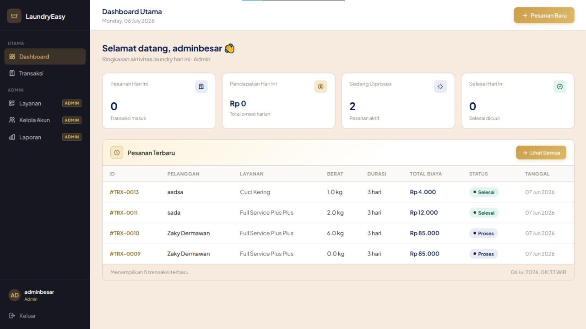
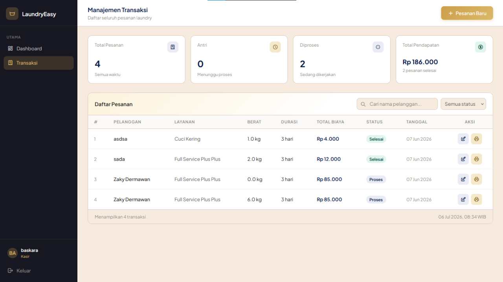

# LaundryEasy 🧺

Aplikasi manajemen laundry berbasis web untuk mengelola layanan, transaksi, akun kasir, dan laporan bulanan. Dibangun dengan **PHP native** menggunakan pola arsitektur **MVC** yang rapi (tanpa framework), sehingga mudah dipelajari dan dikembangkan.

---

## ✨ Fitur Utama

- 🔐 **Autentikasi & Hak Akses** — login dengan dua peran: **Admin** dan **Kasir**.
- 📊 **Dashboard** — ringkasan transaksi hari ini, pendapatan, pesanan sedang proses, dan selesai bulan ini.
- 🧾 **Manajemen Transaksi** — tambah, edit, hapus, ubah status (antri → proses → selesai), dan cetak **struk**.
- 🧮 **Perhitungan Biaya Otomatis** — total dihitung dari berat × (tarif per kg + biaya kilat) sesuai durasi pengerjaan.
- 🧴 **Manajemen Layanan** — CRUD daftar layanan beserta tarif per kg.
- 👥 **Kelola Akun** — kelola user (Admin/Kasir), khusus untuk Admin.
- 📈 **Laporan Bulanan** — statistik per bulan, layanan terlaris, dan **export/cetak** laporan.

---

## 🖼️ Tampilan Aplikasi

> Letakkan gambar Anda di folder [`screenshots/`](screenshots) dengan nama berikut (atau sesuaikan nama file di bawah ini).

| Halaman Login | Dashboard |
|:---:|:---:|
|  |  |

| Daftar Transaksi |
|:---:|
|  |

---

## 🛠️ Teknologi

| Bagian | Teknologi |
|---|---|
| Bahasa | PHP (native, tanpa framework) |
| Database | MySQL / MariaDB |
| Akses DB | PDO (prepared statement) |
| Styling | Tailwind CSS (CDN) + CSS kustom per halaman |
| Ikon | Tabler Icons (CDN) |
| Arsitektur | MVC (Model - View - Controller) |

---

## 🏗️ Struktur Proyek

```
laundry-easy/
├── app/                       # "Otak" aplikasi (tidak bisa diakses browser)
│   ├── Config/
│   │   └── Database.php        # koneksi PDO (singleton)
│   ├── Core/
│   │   └── Controller.php      # base class: render(), guard, flash, redirect
│   ├── Models/                 # query database
│   │   ├── User.php
│   │   ├── Layanan.php
│   │   ├── Transaksi.php       # + rumus biaya
│   │   └── Laporan.php
│   ├── Controllers/            # logika tiap halaman
│   │   ├── AuthController.php
│   │   ├── DashboardController.php
│   │   ├── LayananController.php
│   │   ├── TransaksiController.php
│   │   ├── AkunController.php
│   │   └── LaporanController.php
│   └── bootstrap.php           # autoload class + session_start()
│
├── views/                     # tampilan (HTML), tanpa query DB
│   ├── auth/         login.view.php
│   ├── dashboard/    index.view.php
│   ├── layanan/      index | tambah | edit .view.php
│   ├── transaksi/    index | tambah | edit | struk .view.php
│   ├── akun/         index.view.php
│   └── laporan/      index | export .view.php
│
├── Backend/                   # endpoint aksi (dispatcher tipis ke Controller)
│   ├── login_process.php
│   ├── layanan_simpan.php | layanan_update.php | layanan_hapus.php
│   ├── proses_transaksi.php | transaksi_hapus.php | update_status.php
│   └── proses_akun.php
│
├── css/                       # file CSS per halaman
├── database/                  # skema SQL (laundry_easy.sql)
├── SQL/                       # (opsional) query tambahan
│
├── index.php                  # redirect ke dashboard
├── login.php  / logout.php
├── dashboard.php
├── layanan.php | layanan_tambah.php | layanan_edit.php
├── transaksi.php | transaksi_tambah.php | transaksi_edit.php | transaksi_update.php
├── struk.php
├── kelola_akun.php
├── laporan.php | laporan_export.php
└── package.json
```

### Cara kerja arsitektur
- **File entry di root** (mis. `dashboard.php`) hanya memuat `app/bootstrap.php` lalu memanggil controller terkait.
- **`Backend/`** berisi dispatcher tipis untuk aksi form (POST) yang meneruskan ke method controller.
- **`bootstrap.php`** melakukan autoload class (Config, Core, Models, Controllers) + `session_start()` dan mendefinisikan `BASE_URL` otomatis.
- **View** murni tampilan — semua query database ada di Model, logika ada di Controller.

---

## 🚀 Instalasi

### Prasyarat
- PHP 8.0+
- MySQL / MariaDB
- Web server (Apache/Nginx) atau XAMPP/Laragon

### Langkah

1. **Clone repository**
   ```bash
   git clone https://github.com/<username>/laundry-easy.git
   ```
   Letakkan di folder web server (mis. `htdocs` untuk XAMPP).

2. **Buat & import database**
   ```bash
   mysql -u root -p < database/laundry_easy.sql
   ```
   Atau import `database/laundry_easy.sql` lewat phpMyAdmin.

3. **Atur koneksi database**
   Buka `app/Config/Database.php` dan sesuaikan bila perlu:
   ```php
   const HOST = 'localhost';
   const NAME = 'laundry_easy';
   const USER = 'root';
   const PASS = '';
   ```

4. **Buat akun Admin pertama**
   Password harus di-hash bcrypt. Buat hash-nya dulu:
   ```bash
   php -r "echo password_hash('rahasia123', PASSWORD_BCRYPT), PHP_EOL;"
   ```
   Lalu jalankan di MySQL:
   ```sql
   INSERT INTO users (username, password, role)
   VALUES ('admin', '<TEMPEL_HASH_DI_SINI>', 'Admin');
   ```

5. **Jalankan aplikasi**
   Buka di browser, contoh:
   ```
   http://localhost/laundry-easy/
   ```
   Login dengan `admin` / `rahasia123`.

---

## 💡 Rumus Biaya

| Durasi | Jenis | Biaya tambahan / kg |
|:---:|---|:---:|
| 1 hari | Kilat | + Rp 5.000 |
| 2 hari | Express | + Rp 2.000 |
| 3 hari | Reguler | + Rp 0 |

```
total_biaya = berat_kg × (tarif_per_kg + biaya_tambahan_durasi) + biaya_tambahan_lain
```

---

## 👤 Peran Pengguna

| Fitur | Admin | Kasir |
|---|:---:|:---:|
| Dashboard | ✅ | ✅ |
| Transaksi (CRUD) | ✅ | ✅ |
| Layanan (CRUD) | ✅ | ✅ |
| Laporan | ✅ | ✅ |
| Kelola Akun | ✅ | ❌ |

---

## 📄 Lisensi

Proyek ini dibuat untuk keperluan pembelajaran. Silakan gunakan dan modifikasi sesuai kebutuhan.
